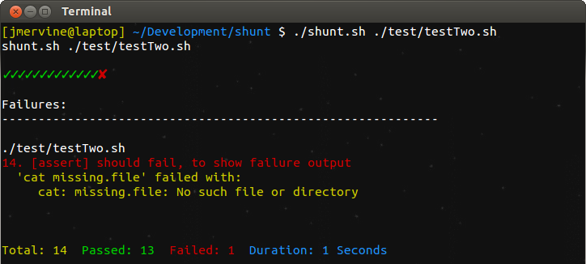
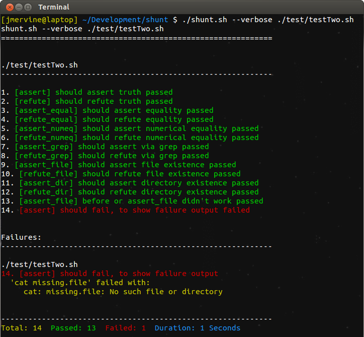

# [shunt](https://github.com/odb/shunt)

##### Simple Shell Testing Pseudo-Framework

[](https://raw.github.com/odb/shunt/master/screenshots/shunt.png)

[](https://raw.github.com/odb/shunt/master/screenshots/shunt_verbose.png)

[](https://raw.github.com/odb/shunt/master/screenshots/shunt_quiet.png)

### What!? Why?

For a recent project, I wanted a very simple way to run some simple tests against my script output.
I know there are a number of these kinds of things out there, but most of the ones I looked at were more complex then I wanted.
To start, I created a basic shell script to test my scripts, but as I began to add to it, and want more from it, I decided to take
a few minutes and build a pseudo-framework out of it.

I call it a "pseudo-framework" because it's really more of a helper, which gives you a handfull of assertions to run against
bash commands. Well, that and it doesn't really have a name.

### How?

##### Install

Note, in shunt `latest` means latest stable version.

    curl -L https://raw.github.com/odb/shunt/master/install.sh | bash
    # installs latest to ~/.bin/shunt

    curl -L https://raw.github.com/odb/shunt/master/install.sh | bash -s master
    # installs master to ~/.bin/shunt

    curl -L https://raw.github.com/odb/shunt/master/install.sh | bash -s global
    # installs latest to /usr/local/bin/shunt

    curl -L https://raw.github.com/odb/shunt/master/install.sh | bash -s master local
    # installs master to ./shunt.sh

##### Basic Usage

A basic test file looks like this:

    # file: tests.sh

    function run_tests {
    ####################################################
    # Tests go here.
    ####################################################
      COMMAND="/path/to/your/command"
      assert_grep "$COMMAND" "Usage" \
        "deplay usage without params"
      assert_grep "$COMMAND --help" "Usage" \
        "deplay usage with help"
      assert_grep "$COMMAND --arg2 foobar" "Usage" \
        "deplay usage without required arg"
      refute_grep "$COMMAND --arg1 foobar" "Usage" \
        "work with required arg"
    ####################################################
    }

Run like this:

    $ ./shunt.sh ./tests.sh

Usage:
``` bash
Usage: ./shunt.sh <test files>

Options:
--plain    Disable colors and icons.
--quiet    Do not print error messages.
--verbose  Display success messages.
--version  Display version information.
--help     Display this message.
```

> See `test/testOne.sh` for more examples.

##### Before / After Hooks

In addition to assertion, shunt also supports before and after hooks. Simply define a `before` or `after` function.

    function before {
        ./some_setup_script.sh
        echo "Running before shunt assertions.
    }

    function after {
        ./some_cleanup_script.sh
        echo "Running after shunt assertions.
    }

##### Assertions

Here's a full list of assertions at the time of this writing:

* `assert "CMD" "FAIL MESSAGE"`
* `refute "CMD" "FAIL MESSAGE"`
* `assert_equal "FIRST" "SECOND" "FAIL MESSAGE"`
* `refute_equal "FIRST" "SECOND" "FAIL MESSAGE"`
* `assert_numeq "FIRST" "SECOND" "FAIL MESSAGE"`
* `refute_numeq "FIRST" "SECOND" "FAIL MESSAGE"`
* `assert_grep "CMD" "GREP" "FAIL MESSAGE"`
* `refute_grep "CMD" "GREP" "FAIL MESSAGE"`
* `assert_file "FILE" "FAIL MESSAGE"`
* `refute_file "FILE" "FAIL MESSAGE"`
* `assert_dir "DIR" "FAIL MESSAGE"`
* `refute_dir "DIR" "FAIL MESSAGE"`

##### Known Issues

Currently, `assert_grep` and `refute_grep` only support a single word, no spaces. I'm sure there's a simple solution to this, but I haven't had
a change to troubleshoot it yet and it wasn't an issue for my use case.


### Development

* To run tests use: `make test`
* To update clistyle.sh, use: `make clistyle`
